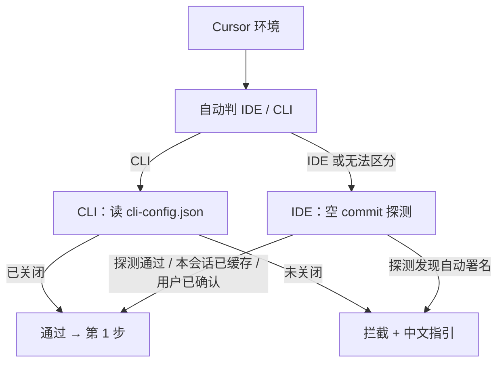

# Git 提交

凡触达 `git commit` 的流程，**必须**全文遵守本 skill。

**禁止**：修改 git config；破坏性 git 命令（`push --force`、`reset --hard`、`checkout .`、`clean -f`）除非用户明确要求；默认 `--no-verify`；`core.hooksPath` 空目录绕过 hook。

**结束**：不 push、不询问 push。

## 第 0 步：Cursor Attribution 预检

**非 Cursor 环境**（如 Claude Code、openCode）→ **跳过**本步。

**Cursor 环境** → 自动区分 **IDE** 与 **CLI**，走对应分支。**禁止**默认询问用户「你用的是 IDE 还是 CLI？」。



### 0.1 自动区分 IDE / CLI（不必问用户）

按优先级读取信号，**自动**分流：

| 优先级 | 信号                                                                                        | 结论                             |
| ------ | ------------------------------------------------------------------------------------------- | -------------------------------- |
| 高     | 环境变量 `CURSOR_LAYOUT=unifiedAgent`，或 `CURSOR_EXTENSION_HOST_ROLE=agent-exec`           | **IDE**                          |
| 中     | 当前为 Cursor Chat/Agent 会话（有工作区、可附加 skill、终端路径在 `.cursor/projects/` 下）  | **IDE**                          |
| 高     | 明确仅在 Cursor CLI Agent 上下文中运行（无 IDE Agent 布局信号，且用户或上下文表明在用 CLI） | **CLI**                          |
| 低     | 仅有 `CURSOR_AGENT=1` 等弱信号、无法区分                                                    | **默认 IDE**（走探测，不问用户） |

**仅**在自动结论与 cli-config 明显矛盾、或 IDE 探测被 hook 阻断无法得出结论时，才向用户提问或请其手动确认。

### 0.2 CLI 分支：读配置文件

`cli-config.json` **仅对 Cursor CLI 生效**；按官方文档读取：

| 层级 | 路径                                                                            |
| ---- | ------------------------------------------------------------------------------- |
| 全局 | `~/.cursor/cli-config.json`（Windows：`%USERPROFILE%\.cursor\cli-config.json`） |
| 项目 | `<repo>/.cursor/cli.json`（若存在）                                             |

期望：`attribution.attributeCommitsToAgent` 与 `attributePRsToAgent` 均为 `false`（或旧字段 `commitAttribution` / `prAttribution` 为 `false`）。

逻辑：

1. 全局文件不存在，或 Attribution 仍为 `true` → **未通过**
2. 项目 `.cursor/cli.json` 存在且 Attribution 仍为 `true` → **未通过**
3. 全局 + 项目（若存在）均为 `false` → **通过**，进入第 1 步

**未通过时输出（中文）** — 创建或编辑 `~/.cursor/cli-config.json`：

```json
{
  "version": 1,
  "attribution": {
    "attributeCommitsToAgent": false,
    "attributePRsToAgent": false
  }
}
```

说明：此配置**仅影响 CLI**；改完后 CLI 路径可重试。**禁止**在未通过时执行正式 commit。

**同步 IDE 设置到 CLI**（可选）：在 Cursor 中执行 `cursor /update-cli-config`，或手动编辑上述 JSON 后重启终端。

**Enterprise 账户**：团队 dashboard 的管理员策略可**强制覆盖**本地 `cli-config.json`（未勾选「Disable attribution」即视为强制开启）。若本地已设为 `false` 仍被注入署名，联系管理员在团队设置中关闭强制 Attribution，而非反复改本地文件。

用户明确回复「已改好 CLI 配置 / 继续提交」→ 可重新读取配置后继续；**不必**走 IDE 空 commit 探测。

### 0.3 IDE 分支：空 commit 探测

IDE **无法**可靠读取 Cursor Settings → Agent → Attribution，改用**实测**判断是否仍会注入自动署名。

**跳过探测**（直接进入第 1 步）若满足其一：

- 本会话内 IDE 探测**已通过**（会话内缓存）
- 用户明确回复「已关闭 Attribution / 已改好配置 / 继续提交」

**探测步骤**（每会话最多一次，通过则缓存）：

1. 探测 message **仅**一行纯文本，**禁止**写 `Co-Authored-By`：

```powershell
git commit --allow-empty -m "cursor-attribution-probe"
```

2. 读取正文：

```bash
git log -1 --format=%B
```

3. **回退探测 commit**（用 mixed reset，**禁止** `--hard`）：

```bash
git reset HEAD~1
```

4. 判定：除 `"cursor-attribution-probe"` 原文外，若还存在以下任一行 → **未通过**，拦截正式 commit：

- `Co-authored-by:` / `Co-Authored-By:` 且含 `@` 或 `<...>`
- `Made with Cursor` 或类似 Cursor 自动 trailer
- 任意带邮箱、尖括号的 co-author 注入行

5. 正文**仅**含探测文案、无上述自动行 → **通过**，标记本会话 IDE 探测已通过，进入第 1 步。

**探测被 hook 拒绝** → 不得视为通过；说明 hook 失败原因，请用户检查 hook 或手动确认 IDE Attribution 已关闭。

**未通过时输出（中文）** — IDE 须**关闭**自动署名（不是开启）：

1. 打开 **Cursor Settings**（不是 VS Code Settings）
2. **Agent → Attribution**
3. **关闭** Commit Attribution（建议同时关闭 PR Attribution）
4. 修改后建议重启 Cursor
5. 完成后回复「已关闭 Attribution / 继续提交」，或重新触发 `/git-commit` 再次探测

**禁止**：为探测创建并提交临时文件（用 `--allow-empty` 即可）；用 `reset --hard` 回退；每次 `/git-commit` 重复探测（已通过则读缓存）。

### 0.4 与正式 commit 自检的联动

正式 commit 后若署名自检发现 Cursor 自动注入行（见第 5 步）：

1. 先尝试 amend 删除污染行
2. amend 后仍出现 → **停止**后续 commit，清除本会话 IDE 探测缓存，回到第 0 步重新探测或请用户关闭 IDE Attribution

## 第 1 步：开局并行（4 条，必须同时跑）

| 命令                       | 用途                                                                         |
| -------------------------- | ---------------------------------------------------------------------------- |
| `git status`               | 工作区 / 暂存区概览                                                          |
| `git diff --stat`          | 未暂存改动规模                                                               |
| `git diff --cached --stat` | 已暂存改动规模                                                               |
| `git log --oneline -5`     | 仅参考近期**拆分习惯**（按模块/按类型等）；**不作为** message 格式或语言依据 |

**禁止**开局跑无 `--stat` 的全文 `git diff`。

### 与近期 log 风格不一致时

`git log --oneline -5` 仅作**拆分参考**。**格式与语言以本 skill 为准**，不以历史 commit 为准。

**语言（硬规则）**：第一行标题、修改内容、修改原因**必须中文**。允许保留代码标识符、文件路径、API 名、配置键等原文（如 `TargetFilling.vue`、`submit_status`），其余叙述用中文。

| 历史现象                           | 处理方式                                      |
| ---------------------------------- | --------------------------------------------- |
| 无 `type emoji:` 前缀              | **仍按**映射表写第一行，**不**模仿历史        |
| emoji / type 与映射表不符          | **仍按**映射表                                |
| 无「修改内容 / 修改原因」分段      | **仍按** QAC 结构（可省略修改原因的情形除外） |
| 无 `Co-Authored-By` 或署名格式不同 | **仍按**单行署名规则                          |
| 历史标题或正文为英文               | **仍写中文**                                  |

**禁止**：因 log 风格不同而降低规范；自动 rebase/amend 历史去统一风格（除非用户明确要求）；为对齐历史而省略 emoji、省略署名、或用英文写标题/正文。

## 第 2 步：拆分

只读：

- `git diff --name-only`
- `git diff --cached --name-only`

**必须**按变更类型拆分，**禁止**把互不隶属的改动混在同一 commit。每个 commit 对应单一 type，可独立回滚。

按路径 / 模块 / 变更类型分组；展示拆分方案后**无需等待确认**，依次 commit。

单文件 stat 过大且无法从文件名判断归属时，可对该文件 `git diff --stat <path>` 辅助拆分，仍不读全文。

## 第 3 步：每批 commit

1. `git add <本批文件>`
2. **`git diff --cached`** → 生成 commit message（**禁止**用未 cached 的 `git diff`）
3. `git commit -F`（见下方模板，按平台选用）
4. 署名自检（见第 5 步）

### PowerShell 提交模板（Windows）

```powershell
$msg = @"
fix🐛: 中文总结

修改内容：
- 变更点

修改原因：
- 原因

Co-Authored-By: Cursor composer-2.5-fast
"@
$utf8 = New-Object System.Text.UTF8Encoding $false
[System.IO.File]::WriteAllText("$PWD\.git\COMMIT_MSG_TMP", $msg.TrimEnd() + "`n", $utf8)
git commit -F .git/COMMIT_MSG_TMP
Remove-Item .git/COMMIT_MSG_TMP -ErrorAction SilentlyContinue
```

### Bash 提交模板（macOS / Linux）

**禁止**用 `git commit -m` 写多行 QAC（易乱码或丢换行）。写入 UTF-8 无 BOM 文件后 `git commit -F`：

```bash
cat > .git/COMMIT_MSG_TMP <<'EOF'
fix🐛: 中文总结

修改内容：
- 变更点

修改原因：
- 原因

Co-Authored-By: Cursor composer-2.5-fast
EOF
git commit -F .git/COMMIT_MSG_TMP
rm -f .git/COMMIT_MSG_TMP
```

## 提交格式（QAC）

```text
type emoji: 一句话总结（≤50 字）

修改内容：
- …（推荐 ≤5 条）

修改原因：
- …（推荐 ≤3 条；与修改内容不必一一对应；可整节省略）

Co-Authored-By: <Agent名> <模型名>
```

| 字段     | 要求                                                                                                             |
| -------- | ---------------------------------------------------------------------------------------------------------------- |
| 第一行   | `type emoji: 中文总结`，≤50 字；**必须中文**；emoji 紧跟 type 无空格；**禁止**使用下表以外的 type 或未配定 emoji |
| 修改内容 | 基于 `git diff --cached`；每条 `- `；**必须中文**（代码标识符/路径/API 名可保留原文）                            |
| 修改原因 | **必须中文**（同上例外）；fix/patch 建议写                                                                       |
| 署名     | 末行单行 `Co-Authored-By: <Agent名> <模型名>`                                                                    |

### Type 与 Emoji 映射

| type     | emoji | 说明              |
| -------- | ----- | ----------------- |
| feat     | ✨    | 新功能            |
| fix      | 🐛    | 修复 Bug          |
| style    | 💄    | 更新 UI 样式      |
| format   | 🥚    | 格式化代码        |
| docs     | 📝    | 添加/更新文档     |
| perf     | 👌    | 性能优化          |
| init     | 🎉    | 初始化项目        |
| test     | ✅    | 添加测试代码      |
| refactor | 🎨    | 重构/改进代码结构 |
| patch    | 🚑    | 紧急修复          |
| config   | 🔧    | 修改配置文件      |
| wip      | 🔥    | 进行中但未完成    |

**可省略「修改原因」**：format / style / docs / config / test 等 obvious 改动，或单点一目了然改动。可仅保留第一行 + 修改内容 + 署名，或极简第一行 + 署名。

**示例**

```text
fix🐛: 已提交状态下跳过步骤校验

修改内容：
- TargetFilling、IndicatorSelection 的 validate 在 disabled 时直接返回 true
- CustomIndTable、SpecialIndTable 的 goNext 增加 disabled 判断

修改原因：
- submit_status 为奇数表示已提交，不应再拦截上一步

Co-Authored-By: Cursor composer-2.5-fast
```

## 第 4 步：Agent 名与署名

| 运行环境    | Agent 名      |
| ----------- | ------------- |
| Cursor      | `Cursor`      |
| Claude Code | `Claude Code` |
| openCode    | `openCode`    |

- **必须**在每条提交信息**末尾**写入**恰好一行**：`Co-Authored-By: <Agent名> <模型名>`
- 模型名可检测时**必须**写；检测不到可只写 Agent 名
- **禁止**尖括号邮箱、`@`、多行 Co-Authored-By、省略署名行

## 第 5 步：署名自检

每次 `git commit` 成功后**必须**执行：

```bash
git log -1 --format=%B
```

确认：

- 存在且仅一行规范 `Co-Authored-By`
- Agent 名正确；可检测时含模型名
- 无带 `<...>` / `@` 的自动注入行

### 失败修正

| 现象                 | 动作                                                               |
| -------------------- | ------------------------------------------------------------------ |
| 缺少署名行           | 末尾补上规范单行署名                                               |
| 多行 Co-Authored-By  | 删多余行，保留一行                                                 |
| 自动注入行（含邮箱） | 删除；amend 后仍出现 → 停止 commit，清除 IDE 探测缓存，回到第 0 步 |
| Agent 名或模型名错误 | 修正为当前环境正确值                                               |

修正时保留 QAC 正文，只改署名相关部分。

### amend 条件

**允许**（须同时满足）：

1. HEAD 为本次会话刚创建的 commit
2. 尚未 push
3. pre-commit hook 未拒绝；hook 改文件则先处理再 amend

**禁止** amend：HEAD 非本次创建、已 push、用户明确要求不要 amend。

执行：`git commit --amend -F .git/COMMIT_MSG_TMP`，禁止默认 `--no-verify`。

同一 commit 最多 amend 2 次；仍失败则停止，输出 `git log -1 --format=%B` 全文、失败项、排查建议（检查 Cursor Attribution、commit-msg hook）。
